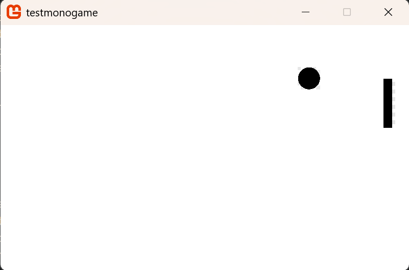
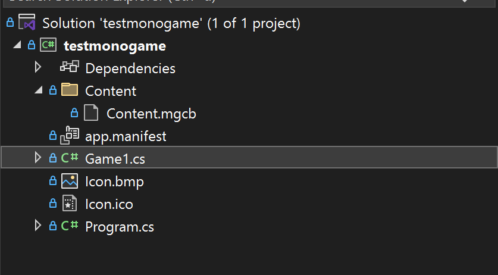
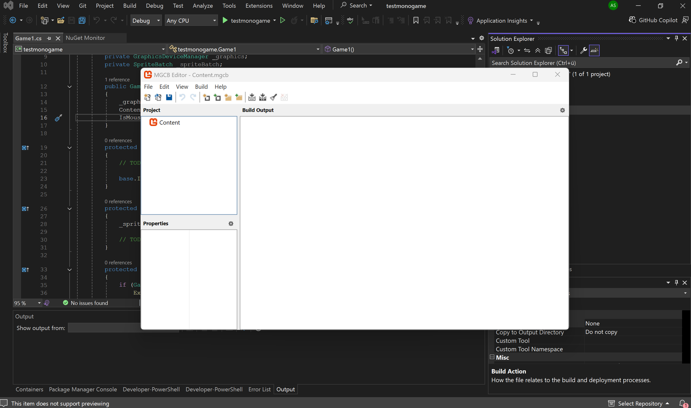

## MonoGame tutorial
In this tutorial we will create a simple pong game using the MonoGame framework. 



----

### Introduction

#### What is MonoGame?
Monogame is a game engine that allows you to create games in the C# programming language. In comparison to other frameworks for game development like Unity, MonoGame does not offer a scene editor or other external tools. All configuration, implementing and other actions (With the exception of uploading images) are done 100% in code. It also does not force you to implement your project using a certain structure (like sprites) and you can specialize your code structure to *your* game. 

----

#### Before we start
For this tutorial we'll assume that you are familliar with programming in C# and know the basics of OOP (object oriented programming). We'll also assume that you Visual Studio 2022 (or any other IDE) set up and have installed the MonoGame framework. For the installation of Monogame you can find a guide here (https://docs.monogame.net/articles/getting_started/2_choosing_your_ide_visual_studio.html)

----

#### The core concept behind monogame
As previously stated MonoGame uses a code first approach while also giving you a lot of freedom to customize the structure of your game. That's why we need to understand some concepts monogame introduces:

Game1.cs: The main file of your game, this is where you write your code
GameTime: The time since the game has started. Useful if you want all players to move at the same speed, regardless of how many frames they get
spriteBatch: The "renderer" of MonoGame. In the draw function you tell it to begin and end and it will draw everything you specified
Sprite: The "standart" way of structuring things in a game. It's an image with a position attached to tell it where to be rendered. But nobody forces you to use it in monogame.

----

### Tutorial
#### Game1.cs
Start off with creating a new empty monogame project. Now you should see a class Came1.cs that contains a constructor and 4 functions. I'll explain what each of them are for and how to use them.

Constructor: Mainly for settings, can be ignored for a small desktop pong
Initialize(): Used for settings of the graphics (such as window size)
LoadContent(): Used to load images into memory to paint them onto the window later
Update(): For doing the game logic (for example calculating player position, applying gravity etc.)
Draw(): For painting textures

For now we can write all the code into these functions. Later we'll make specific classes to have the code be a bit cleaner

----

#### Drawing
For our first step we'll try to load a simple image. In our case a bat for the pong later. In order to do that we'll first need to find an image. For this you can google a nice image for your bat and download it. Then **you can't just paste the image into a folder**. You'll need to use a tool provided by monogame. You'll find it in the Contend/Content.mgcb folder where you can run it by double clicking it.

You should then see the editor where you can upload your assets.

Using the "Add Existing Item" button (box with green plus) you can then select your asset and upload it into monogame. It then shows a popup that tells you how to upload it. You upload by using the setting "copy the file to the directory". After your assets have uploaded you can then build/rebuild your images. This way monogame knows what files you have and how to load them. 


Next up you need to tell MonoGame to load your asset so that you can use it later. By creating a Texture2D field and in loading the image into it in the LoadContend function with the following line you can then use it in the Draw function.
```paddle = Content.Load<Texture2D>("paddle"); //filename without ending```
Now in order to actually draw this texture you need to adapt your draw function to look like this:
```csharp
protected override void Draw(GameTime gameTime)
{
    GraphicsDevice.Clear(Color.CornflowerBlue);


    _spriteBatch.Begin(samplerState: SamplerState.PointClamp);

    double scale = 0.5;
    int ypos = 50;
    // a rectangle where the paddle is
    Rectangle box = new Rectangle(750, ypos, (int)(paddle.Width * scale), (int)(paddle.Height * scale));

    // draw the paddle where the box is and warp the color towards white
    _spriteBatch.Draw(paddle, box, Color.White);

    _spriteBatch.End(); //tell monogame that the frame is finished and can now be displayed

    base.Draw(gameTime);
}
```
If you now run the file you should now see your paddle displayed.

----

#### Input
Input in monogame is about as simple, if not even simpler then output. Lets say we want to make the paddle move up and down depending on what the user presses. For this we'll first have to make the yposition of the paddle a field so that we can control it from our update function. Then we can just simply in our update function check if a key is down by using ```Keyboard.GetState().IsKeyDown(Keys.Up)``` which gives us a bool which we can check using an if statement. This allows us to use something a long the following in the Update function.

```csharp
protected override void Update(GameTime gameTime)
{
    if (GamePad.GetState(PlayerIndex.One).Buttons.Back == ButtonState.Pressed || Keyboard.GetState().IsKeyDown(Keys.Escape))
        Exit();

    // TODO: Add your update logic here

    if (Keyboard.GetState().IsKeyDown(Keys.Down))
    {
        ypos += 5;
    }
    if (Keyboard.GetState().IsKeyDown(Keys.Up))
    {
        ypos -= 5;
    }
    base.Update(gameTime);
}
```

And like this we have our movement implemented. Now the paddle should move up and down if you press the respective keys!

----

#### Structuring
At the moment our code is a bit messy. Imagine you'd have to implement an entire massive game in this one file. That's why we can use OOP to help us out and group things a bit better. For this we'll implement the ball in such a manner. 
To start off with we'll create a Ball class. This class will have 3 major functions:

Constructor: Inject texture
Update() : Update logic of the ball such as bouncing
Draw() : Draw the ball on the window

And this means the class looks like that:
```csharp
using Microsoft.Xna.Framework;
using Microsoft.Xna.Framework.Graphics;

namespace testmonogame
{
    public class Ball
    {
        Texture2D _texture;
        Rectangle position;
        Viewport _viewport;
        Vector2 velocity;

        public Ball(Texture2D texture, Viewport vp)
        {
            double scale = 0.5;
            _viewport = vp;
            _texture = texture;

            // Initialize position
            position = new Rectangle(100, 100, (int)(texture.Width * scale), (int)(texture.Height * scale));

            velocity = new Vector2(200f, 200f);
        }

        public void Update(GameTime gameTime)
        {
            // 1. Move the ball based on velocity and elapsed time
            float deltaTime = (float)gameTime.ElapsedGameTime.TotalSeconds;

            int nextX = position.X + (int)(velocity.X * deltaTime);
            int nextY = position.Y + (int)(velocity.Y * deltaTime);

            position.X = nextX;
            position.Y = nextY;

            // 2. Check Horizontal Walls (Left and Right)
            if (position.Left < 0 || position.Right > _viewport.Width)
            {
                velocity.X *= -1; // Reverse horizontal direction

                // Keep the ball inside the screen so it doesn't get stuck
                position.X = MathHelper.Clamp(position.X, 0, _viewport.Width - position.Width);
            }

            // 3. Check Vertical Walls (Top and Bottom)
            if (position.Top < 0 || position.Bottom > _viewport.Height)
            {
                velocity.Y *= -1; // Reverse vertical direction

                // Keep the ball inside the screen
                position.Y = MathHelper.Clamp(position.Y, 0, _viewport.Height - position.Height);
            }
        }

        public void Draw(GameTime gameTime, SpriteBatch spriteBatch)
        {
            spriteBatch.Draw(_texture, position, Color.White);
        }
    }
}
```
Now in order to call this class respectively in game.cs we'll add a field for our Ball object and we'll change the LoadContent to this:
```csharp
protected override void LoadContent()
{
    _spriteBatch = new SpriteBatch(GraphicsDevice);
    // TODO: use this.Content to load your game content here

     Viewport vp = _graphics.GraphicsDevice.Viewport;

    paddle = Content.Load<Texture2D>("paddle");
    Texture2D balltexture = Content.Load<Texture2D>("ball");
    ball = new Ball(balltexture, vp);     
}
```
The viewport is just a box of the coordinates that tells the ball where the window stops. Now we only need to add the Update and Draw functions in their respective counterpart in game.cs and we should see the ball bouncing around. 

----

#### Collisions
As you may now see the ball just completely ignores the paddle. In order to counter this we'll have to introduce collisions into our game. Collisions are also rather simple because as you may remember both of our objects have a Rectangle that tells them where they are. And luckily for us the MonoGame Rectangle allows us to check if two overlap. For this we'll modify the ball's update and add a parameter for the rectangle that tells us where the bat is. We then make a check if the two overlap with the statement ```if (rect1.Intersects(rect2))```. This means that our balls new update now looks like this:
```csharp
public void Update(GameTime gameTime, Rectangle paddle)
{
    // 1. Move the ball based on velocity and elapsed time
    float deltaTime = (float)gameTime.ElapsedGameTime.TotalSeconds;

    int nextX = position.X + (int)(velocity.X * deltaTime);
    int nextY = position.Y + (int)(velocity.Y * deltaTime);

    position.X = nextX;
    position.Y = nextY;

    // if collision bounce
    if (paddle.Intersects(position))
    {
        velocity.X *= -1;
    }

    //Wall collision checks
    ...
}
```

And by adding the rectangle as a parameter in game.cs we can now detect collisions. 

----

#### What now?
Well now you've written a simple pong. You've also learned the basics of MonoGame and there really isn't a lot more to it. There are other concepts which we skipped (Music, SourceRectangles) but with these basics you should be able to make a pretty decent game. The part where there's most to learn would be with the general structure of the game. Theres lots of ways to implement a good structure (for example making everything a sprite) to make the game more modular, but that's a rather general topic which isn't only relevant for MonoGame.

----

### Possible Problems
#### It says that i can't convert a Vector2 to a Vector2... what?
This is because both System.Drawing and MonoGame add a Vector2 which is a bit ambiguous. When typing you should always select the Windows.XNA.Framework one

----

#### I can't import the texture i want to
This is likely because you either:
 - simply pasted in the file without using the MGCB Editor
 - forgot to build after adding the file
 - have a typo in your filename
 - added a file extension (Monogame only needs filename, so write image instead of image.jpg)